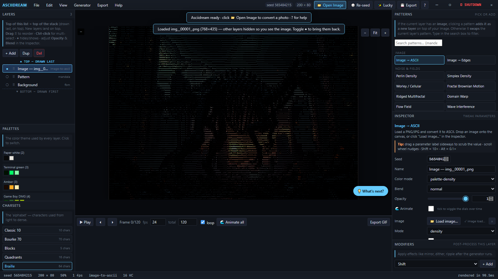

# Asciidream



> ASCII / Unicode generative art studio — runs as one portable Windows .exe. Drop a photo to convert it to ASCII, or pick from 35+ algorithmic patterns. Offline-first. Deterministic. No telemetry. No accounts.


---

## What it is

Asciidream takes either a photograph or an algorithmic generator and renders it as a grid of characters — with proper colour, multiple stackable layers, blend modes, alpha, and per-parameter animation that exports to real animated GIF. Everything runs locally inside a single Windows binary; nothing phones home.

Built around a plugin-style architecture (see `ASCII_PATTERN_STUDIO_SPEC.md`) so adding a new pattern is a single self-contained block — no UI work.

## Quick Start

1. Download **`Asciidream.exe`** from the [Releases page](../../releases/latest).
2. Double-click. The window opens — no install, no Python, no admin.
3. Click **📁 Open Image** (or drag a PNG/JPG onto the canvas) — your photo turns into ASCII art instantly.
4. Tweak with the Inspector on the right. Press `?` for the keyboard guide.

> **No install. No Python. No Node. No admin rights.** Open it, use it, delete it.

## Features

- **🖼 Image → ASCII** — drag any PNG/JPG/GIF onto the canvas. Density / edge-detect / dithered modes. Optional sampling of original photo colours.
- **🎨 35+ Patterns** across Noise/Fractal/CA/Geometric/Particle/Typographic — Perlin, fBm, Worley, Mandelbrot, Julia, Burning Ship, L-System, Strange Attractors, Game of Life, Wolfram Elementary CA, Brian's Brain, Truchet tiles, Voronoi, Maze, Phyllotaxis, DLA, Slime mold, Banner text, Mandala wrap, Mosaic, and more.
- **🪜 Layers** with 17 blend modes (normal / multiply / screen / overlay / soft-light / darken / lighten / add / subtract / difference / darken-char / lighten-char / char-only / color-only / replace-where-space / erase / mask). Drag-`⠿`-to-reorder. Ctrl-click for multi-select. Per-layer opacity slider.
- **🌊 Animation** — toggle Animate on any layer and every numeric parameter wiggles on its own sine wave. Adjustable wiggle amount + speed per layer. **Animate all** button to start every visible layer at once.
- **🎞 Real GIF export** — inline GIF89a encoder (no external dependencies). Real animated `.gif` files that play in any viewer.
- **🎯 Scrub-drag inputs** — drag any parameter label sideways to scrub the value, Shift = 10×, Alt = 0.1×. Mouse-wheel for nudge. Modal-free, ergonomic.
- **💡 Built-in coach** — context-aware "What's next?" panel that suggests one-click ideas based on your current layer (try Braille charset, switch to edges, add a Kaleidoscope modifier, recolor with a random palette, etc.).
- **💾 Export formats** — TXT, ANSI (true-colour escape codes), SVG (vector), PNG, HTML (standalone with inline color), Markdown, JSON, animated GIF, `.glyph` project files.
- **⌨️ Keyboard-first** — Ctrl+K command palette, Ctrl+R Lucky, R re-seed, Ctrl+Z undo (everything is undoable), `?` shortcuts.
- **🪟 Custom dark titlebar** — no white Windows chrome; the window blends with the app theme. Dedicated red `⏻ SHUTDOWN` button for a clean exit.

## Pattern Categories

| Category | Patterns |
|---|---|
| **Image** | Image → ASCII (density/edges/dithered), Image → Edges |
| **Noise & Fields** | Perlin, Simplex, Worley/Cellular, fBm, Ridged Multifractal, Domain Warp, Flow Field, Wave Interference, Voronoi |
| **L-Systems & Fractals** | Mandelbrot, Julia, Burning Ship, L-System (Koch, Sierpinski, Dragon, Hilbert, Plant, Arrowhead, Peano), Strange Attractors (Clifford, De Jong, Lorenz, Peter de Jong, Aizawa), Quadtree |
| **Cellular Automata** | Conway's Game of Life (B/S rule editor), Wolfram Elementary CA (rules 0–255), Brian's Brain |
| **Geometric** | Truchet Tiles, Tilings (square/brick/hex/checker), Mazes (backtracker/Prim/sidewinder/binary), Phyllotaxis Spiral, Spirograph (hypo/epi/rose/Lissajous), Concentric Rings |
| **Particle / Agent** | DLA Tree, Random Walks, Slime Mold (Physarum) |
| **Typographic** | Random Soup, Marquee Text, Big Banner (block font) |
| **Hybrid** | Mandala (radial wrap), Mosaic (per-region random generator), Solid Fill |

## Stack

```
┌─────────────────────────────────────────────────┐
│  Single self-contained Asciidream.exe (~16 MB)  │
├─────────────────────────────────────────────────┤
│  PyInstaller --onefile --windowed               │
├─────────────────────────────────────────────────┤
│  asciidream.py    pywebview frameless host      │
│      └─ js_api: file picker, save, window ctrl  │
├─────────────────────────────────────────────────┤
│  asciidream.html  all UI + engine in one file   │
│      ├─ TS-strict-style ES2020                  │
│      ├─ Mulberry32 seeded RNG                   │
│      ├─ Perlin / Simplex / Worley / Value noise │
│      ├─ OKLab colour interpolation              │
│      ├─ CharGrid + plugin generator interface   │
│      ├─ Undo/redo command stack (merge-by-tag)  │
│      ├─ Inline GIF89a encoder (LZW from omggif) │
│      └─ Canvas2D renderer (batched by colour)   │
└─────────────────────────────────────────────────┘
```

No bundled fonts (uses system monospace). No CDN. No telemetry. No analytics. No accounts.

## Determinism

Every render is a pure function of `{ generatorId, params, seed, canvas_size, charset, palette, layer_stack, modifiers }`. There is no use of `Math.random()` inside any generator — they all draw from a seeded Mulberry32 RNG. Save a `.glyph` project, open it on another machine, and you get the same pixels.

## Wiki

Full documentation lives on the [Wiki](../../wiki) — every feature with annotated screenshots: image-to-ASCII modes, the full pattern catalog with one image per generator, the blend-mode reference, animation guide, GIF export tutorial, keyboard shortcuts, and a developer architecture page for adding your own generators.

## Build from source

You shouldn't need to — the .exe is portable — but if you want to:

```cmd
git clone https://github.com/aivrar/asciidream
cd asciidream
build.bat
```

Produces `dist\Asciidream.exe`. Requires Python 3.11+ and the `pywebview` and `pyinstaller` pip packages (the bat installs them).

## Credits

- Encoder logic for the inline GIF89a writer is based on **omggif** by Dean McNamee (MIT/public-domain).
- Algorithms across generators: Inigo Quilez (domain warp), Steven Wittens, Wolfram, Mandelbrot, Julia, Conway, Lindenmayer, Reynolds. The literature stands on its own.
- Built on **pywebview** (Roman Sirokov) and **PyInstaller**.

## License

MIT. Use it, fork it, ship it.
